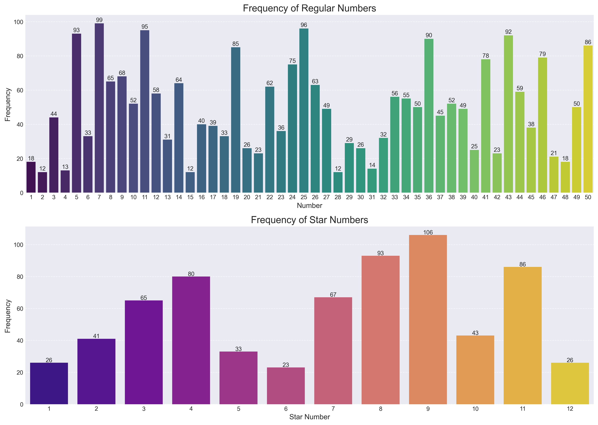

# EuroMillions Data Analysis

This project provides a comprehensive analysis of EuroMillions lottery draw data to identify patterns, frequencies, and insights about drawn numbers.



## Project Overview

The EuroMillions lottery is a popular transnational lottery that requires 7 correct numbers to win the jackpot: 5 regular numbers from a pool of 50 and 2 star numbers from a pool of 12. This project analyzes historical draw data to:

- Calculate and visualize the frequency distribution of all regular and star numbers
- Identify the most commonly drawn numbers
- Create data visualizations for pattern recognition
- Provide insights based on historical draw data

While past results don't determine future outcomes (each draw is independent), this analysis offers interesting insights into the historical distribution of lottery numbers.

## Features

- **Data Loading and Processing**: Loads and processes EuroMillions draw data from CSV
- **Frequency Analysis**: Calculates the frequency of each regular and star number
- **Statistical Analysis**: Provides basic statistics about the dataset
- **Data Visualization**: Creates bar charts showing the frequency distribution of numbers
- **Error Handling**: Robust error handling with fallback to sample data if needed
- **Save Functionality**: Automatically saves high-resolution visualizations

## Getting Started

### Prerequisites

- Python 3.8+
- Git (optional, for cloning the repo)

### Installation

1. Clone the repository (or download it directly):
   ```bash
   git clone https://github.com/yourusername/euromillions-data-analysis.git
   cd euromillions-data-analysis
   ```

2. Create and activate a virtual environment:
   ```bash
   python3 -m venv venv
   source venv/bin/activate  # On Windows: venv\Scripts\activate
   ```

3. Install the required packages:
   ```bash
   pip install -r requirements.txt
   ```

### Usage

1. Ensure you have the EuroMillions data CSV file (`EuroMillions_numbers.csv`) in the project directory.

2. Run the Jupyter notebook:
   ```bash
   jupyter notebook euromillions_analysis.ipynb
   ```

3. Alternatively, you can run the notebook in VS Code:
   - Open VS Code
   - Install the Python and Jupyter extensions if you haven't already
   - Open the project folder in VS Code
   - Open the notebook and run the cells

## Data Format

The expected format for the `EuroMillions_numbers.csv` file is:

| Draw Date | N1 | N2 | N3 | N4 | N5 | S1 | S2 |
|-----------|----|----|----|----|----|----|----| 
| DD/MM/YYYY | ## | ## | ## | ## | ## | ## | ## |

Where:
- `Draw Date`: The date of the EuroMillions draw (DD/MM/YYYY format)
- `N1` to `N5`: The five regular numbers drawn (1-50)
- `S1` to `S2`: The two star numbers drawn (1-12)

## Analysis Components

The notebook is structured in logical sections:

1. **Library Import**: Importing the necessary data analysis and visualization libraries
2. **Data Loading**: Loading and initial processing of the CSV data
3. **Dataset Information**: Basic overview of the dataset's structure and properties
4. **Basic Statistics**: Calculating frequency statistics for regular and star numbers
5. **Data Visualization**: Creating visual representations of number frequencies
6. **Conclusion and Next Steps**: Summary of findings and potential further analyses

## Project Structure

```
euromillions-data-analysis/
├── README.md                     # Project documentation
├── euromillions_analysis.ipynb   # Jupyter notebook with analysis
├── EuroMillions_numbers.csv      # Dataset of historical draws
├── euromillions_frequencies.png  # Generated visualization
├── requirements.txt              # Python dependencies
└── venv/                         # Virtual environment directory
```

## Further Development Opportunities

- Implement time series analysis to detect trends over time
- Add analysis of number combinations (pairs, triplets, etc.)
- Calculate the probability of specific combinations
- Develop a prediction model (for educational purposes only)
- Create a web dashboard to display the analysis interactively

## License

This project is open source and available under the [MIT License](LICENSE).

## Acknowledgments

- EuroMillions lottery for providing the historical draw data
- The data science community for inspiration and best practices